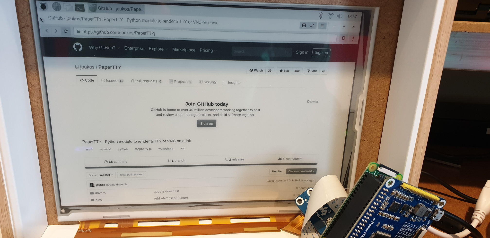
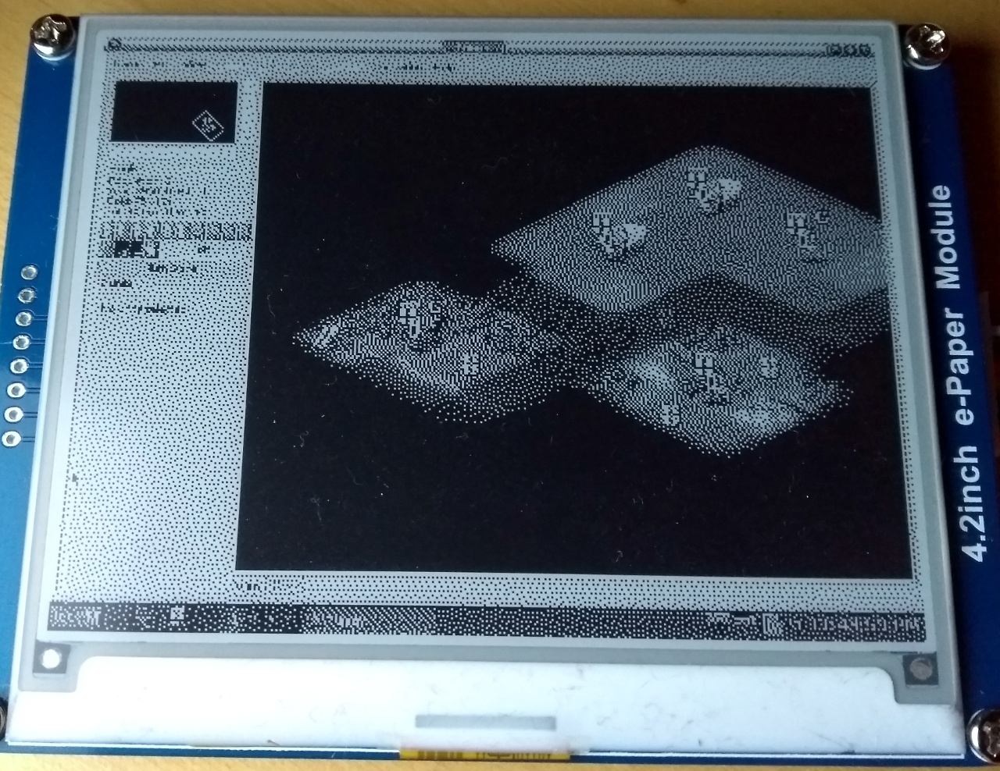
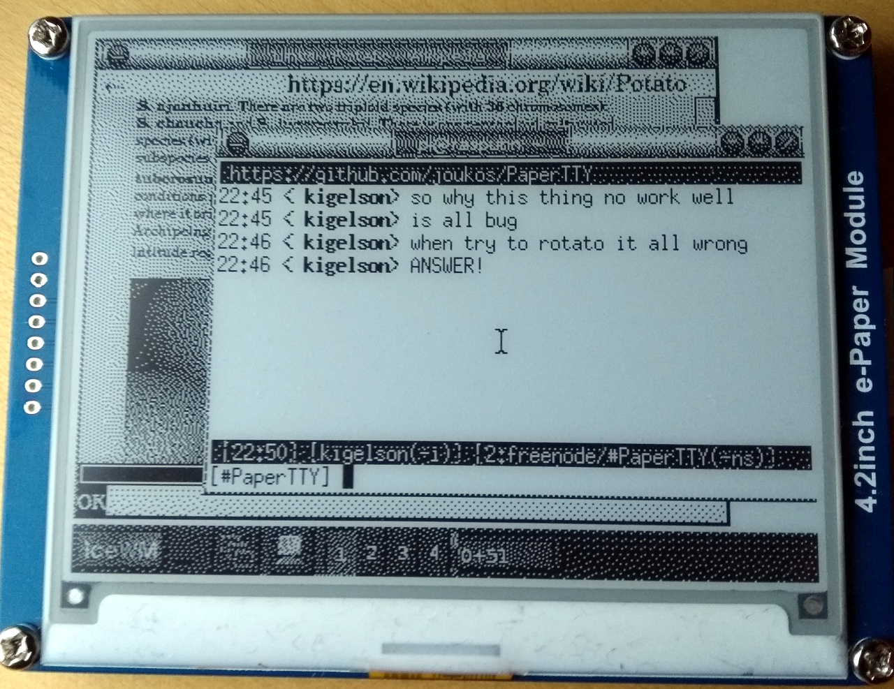
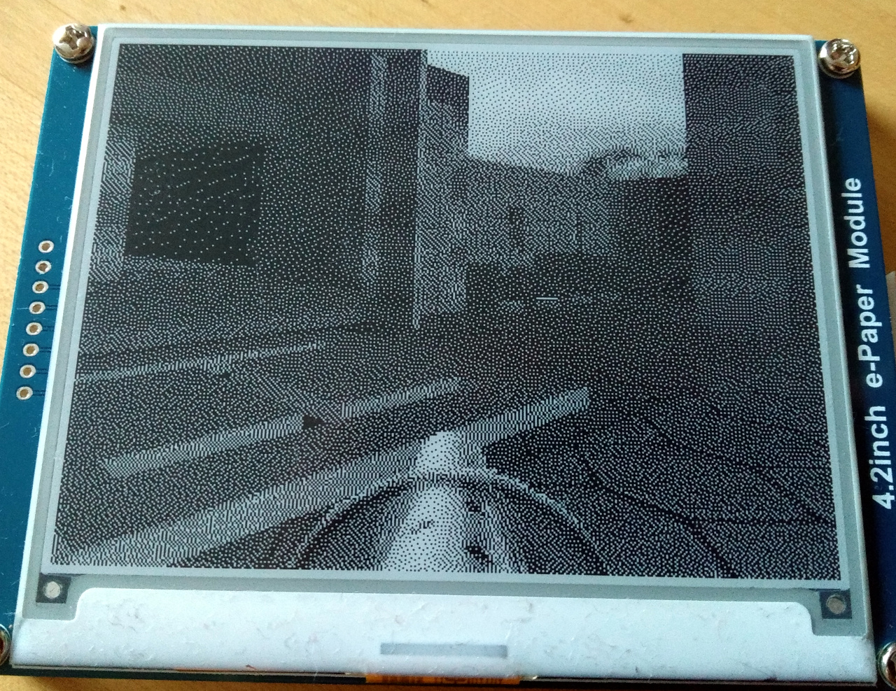
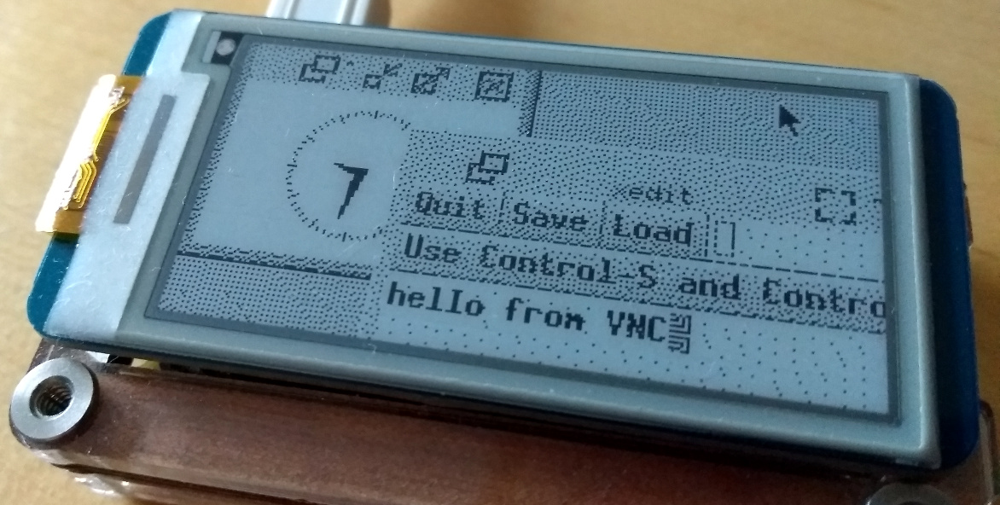
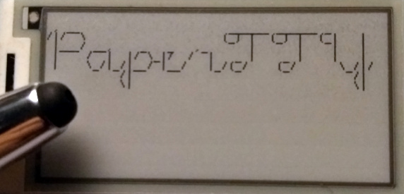
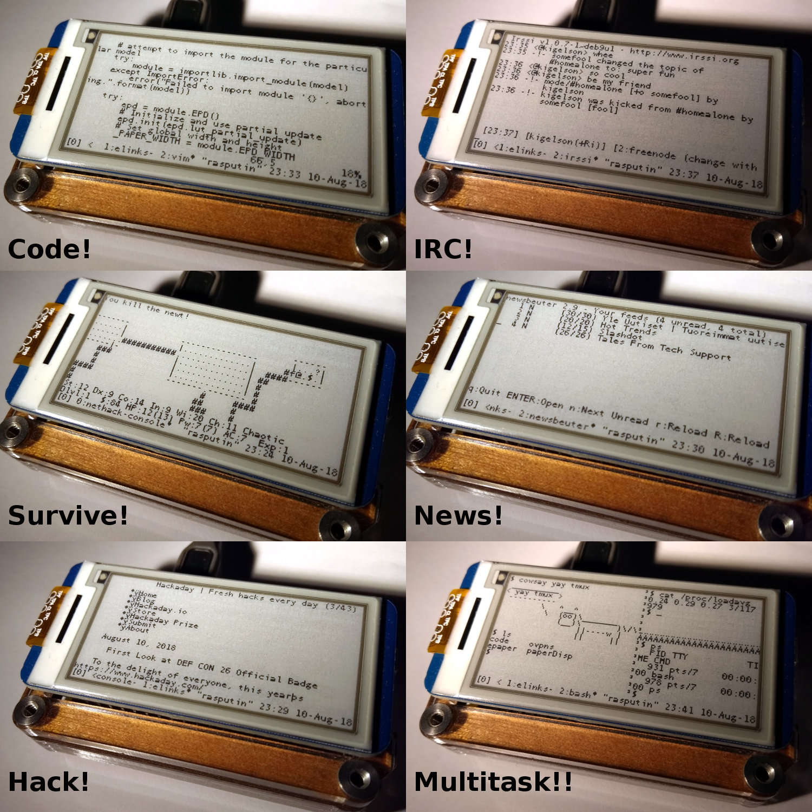
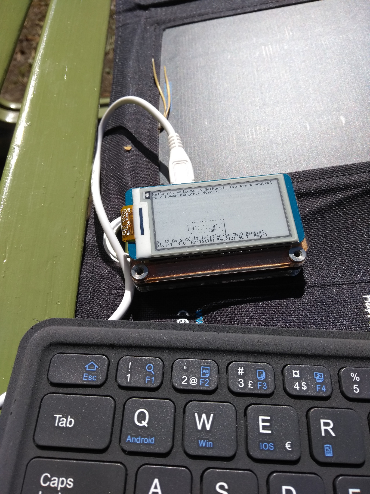
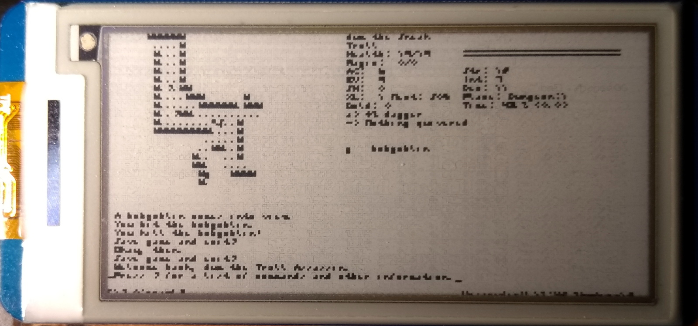
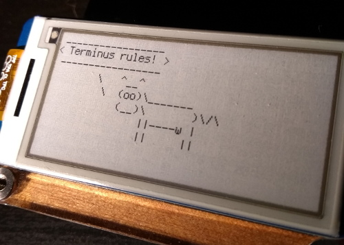

# PaperTTY

## Overview

PaperTTY is a simple Python module for using affordable SPI e-ink displays as a computer monitor, with a Raspberry Pi being the typical computer interfacing with the display. Most of the tested displays are Waveshare branded, but also others - particularly ones using the IT8951 controller - might work.

Things it can display on the e-ink:
| Subcommand | Description                             |
| ---------- | --------------------------------------- |
| `fb`       | Framebuffer (`/dev/fbX`)                |
| `terminal` | Linux virtual console (`/dev/vcs[au]X`) |
| `vnc`      | VNC desktop                             |
| `image`    | Image files                             |
| `stdin`    | Standard input                          |

To use any feature, you need to select an appropriate driver for your e-ink display as a top-level option (`papertty --driver X ...`). To see the list of drivers, use `papertty list`.

To see help for individual subcommands, use `--help` with them, ie. `papertty --driver X --terminal --help`.

## Usage

PaperTTY is currently packaged using Poetry, however it can be installed via pip too. The instructions here are for Raspberry Pi (please open an issue if you need support for another platform).

**You need to enable SPI first:**
- `sudo raspi-config`
  - `Interfacing Options -> SPI -> Yes`
- May want to reboot just in case

**Then, you also need some system dependencies:**

- `sudo apt install python3-venv python3-pip libopenjp2-7 libtiff5 libjpeg-dev`

### Install with pip to virtualenv

If you just want it installed as packaged in PyPi (if you need to modify something use the Poetry way instead - also note that it is possible for the package in PyPi to not match the latest source):

```bash
python3 -m venv papertty_venv
source papertty_venv/bin/activate
pip install papertty
papertty_venv/bin/papertty --help
```

### Install with Poetry

The "correct" way to set up PaperTTY is using Poetry. This gives you the most flexibility and handles the virtualenv creation automatically. Sometimes with VNC issues one may need to downgrade `vncdotool` to `0.13.0`, too, which is not as easy with the pip method.

**First you need to install Poetry, refer to their [instructions](https://python-poetry.org/docs/#installation).**

Then:

```bash
git clone https://github.com/joukos/PaperTTY.git
cd PaperTTY
poetry install  # if you change something with the deps, do a `poetry update`
poetry run papertty --help
```

To get a direct path for the script (which will be run in the virtual environment with all the dependencies), run in the directory: `echo $(poetry env info -p)/bin/papertty`. Append any options you need and this is what you want to start in a SystemD unit or so, possibly with `sudo` depending on the OS configuration and the feature you wish to use.


**The rest of this page has not been updated but is left as reference until a more holistic documentation update is actually done. If you have any issues, please search the existing issues and create a new one if necessary. joukos/2022-01-17**

# Warning - old stuff ahead!

---


## PyPi!

**This is still WIP.**

You can now install PaperTTY via PyPi. The updated (simplified) documentation is still a bit unfinished and things moved around somewhat, so the rest of this page is not quite up to date yet on all details.

TL;DR:

```sh
sudo apt install python3-venv python3-pip libopenjp2-7 libtiff5 libjpeg-dev
# # optionally configure a virtualenv before running pip:
# python3 -m venv papertty_venv
# source papertty_venv/bin/activate
pip3 install papertty
```


----

## Image display command

@colin-nolan has contributed a subcommand to display image files on the screen, allowing to test the displays or easily make a photo slideshow or similar. Try `image --help` to check it out.

## Partial refresh support for 4.2" *(2020-03-01)*

Thanks to @gdkrmr, the 4.2" module now has a new driver that supports partial refresh. Note that now the default behavior is to do partial updates and you'll need to add `--nopartial` to driver settings if you want to use the full refresh instead.

## Interactive Update *(2020-02-18)*

Starting `terminal` with the `--interactive` option adds a menu to the Ctrl-C handler that allows you to change the font, font size and spacing on the fly. This should be helpful when trying out fonts.

## Cursor Update *(2020-01-25)*

The `terminal` mode now supports different cursors. `--nocursor` had been deprecated in favor of `--cursor=none`. The usual underscore-like cursor is set via `--cursor=default`, which, as the name suggests, is also the default mode. There is also a `--cursor=block` option, which inverts the colors at the cursor's location. Finally, there is also an option to provide a numerical value, e.g. `--cursor=5`, which draws an underscore cursor shifted 5 pixels towards the top; `--cursor=default` and `--cursor=0` are thus equivalent.

## Unicode Update *(2020-01-22)*

On systems with /dev/vcsu* (e.g. Raspbian Stretch or Buster, with kernel 4.19+) and when using a TrueType font, the `terminal` mode now has full support for Unicode output. This is automatic, with a fallback to 8-bit if either of these requirements isn't met. We've also changed the standard encoding for 8-bit to ISO-8859-1, which should be a little closer to what the `vcs` device provides.

## IT8951 Optimization II *(2020-01-15)*

The previous optimization was improved further to speed up VNC output too. If you try it, please leave a comment at https://github.com/joukos/PaperTTY/issues/32 (and create a new issue if there's problems).

## IT8951 Optimization *(2020-01-11)*

An optimization by @chi-lambda for the IT8951 driver was merged and may speed up the bit-packing in TTY mode even by up to **10x** for these displays, so the refresh rates should be significantly better now. Please create an issue if there are problems (the unoptimized version can be checked out with the tag `v0.03_unoptimized`).

## IT8951 Update *(2019-11-03)*

Support for IT8951 based displays kindly provided by @fimad has been merged. This means that Waveshare 6", 7.8", 9.7" and 10.3" may work since they use this controller. At least the 6" and 9.7" displays have been verified to work. A big thanks to everyone involved with the discussion and code contributions (https://github.com/joukos/PaperTTY/issues/25)!

If you have one of these displays and want to test it, add your experiences to https://github.com/joukos/PaperTTY/issues/32.

Here is a picture of the 9.7" in action (by @math85360):



[YouTube video](https://www.youtube.com/watch?v=J5WbhSV2E_U)

## VNC Update *(2019-07-07)*

So, it's been almost a year since last update and I've been very very busy.

Since I'm going to be even *busier* for the next two years or so, and probably won't have much time to spend on this project, I wanted to see if I could kludge this one last thing that I think is needed (and was referenced in https://github.com/joukos/PaperTTY/issues/23#issuecomment-435578128): a VNC client to PaperTTY.

**I'm happy to announce that it works!** It's not the most elegant or beautiful thing, but now you can run a graphical desktop and any programs you wish on these epaper screens. It also solves many problems and complexities with text-only terminals, namely encoding/font issues and other quirks. I've tested it with the 4.2" and the 2.13" displays.

The performance is pretty much the same as before, maybe a tad more image processing though, but the bottleneck is the display refresh anyway. All the complex stuff is done by [vncdotool](https://github.com/sibson/vncdotool) by Marc Sibson, since it was the most mature-seeming VNC library I could find that would work with Python 3 without extra work. It's also overkill for the job - all that's needed is to read the screen content periodically.

The way this works is pretty simple: PaperTTY will connect to the VNC server, then just reads the screen content in a loop. If the image changes, the region containing the changes will be updated on the display. This is not actually very efficient and originally I planned to have it update the native VNC "dirty rectangles", but it was simpler to kludge it like this for a start, and it seems to work fine, so it's perhaps easier to make better now.

### Some benefits and features

- **Run all CLI *and* GUI programs**
- Dithers colors so you can throw anything at it and hopefully it's legible on the display
- About as fast as just using the terminal mode, but much less hassle (sort of)
- Has options for rotating and inverting the colors
- Rescales the VNC screen to fit the display (panning not implemented)
- Simplistic, surely buggy and doesn't fix the other problems PaperTTY might have

### Quick start

- Install PaperTTY from PyPi: 
   - `pip install papertty`
- Start a VNC server somewhere (on the RPi for example)
   - ie. `vncserver -geometry 250x128 :1`
- Run PaperTTY as usual, but use the `vnc` subcommand (see `--help` for options)
   - ie. `sudo papertty --driver epd2in13 vnc --display 1 --password supAPass --sleep 0.1 --rotate 90`
   - This would (by default) connect to `localhost`, display `1` (= port 5901), using the 2.13" driver, specifies the password, sleeps 0.1 seconds after each update, and rotates the screen by 90 degrees
- If image looks wonky, make sure you have the right orientation for the VNC server (ie. `-geometry 300x400` vs. `-geometry 400x300`) and the correct `--rotate` value.

### Standalone RPi with mouse and keyboard

So, you have your nice display and a RPi that you want to combine into a cool e-ink laptop, using peripherals plugged into the RPi. There's currently no automation or service files for this purpose, but what you can try is this (for the 2.13"):

- Install or enable a desktop environment / window manager, unless it already exists (ie. if you plug in the HDMI port, you should get a graphical session)
- Install `x11vnc` on the RPi
- Plug in keyboard and mouse
- Start a `tmux` session on the RPi and run the following commands, in their own windows (to easily find out if something goes wrong)
- ```sh
  # tmux window/pane #0
  sudo lightdm    # start lightdm if not already started
  export $(sudo x11vnc -findauth)	# find the X authority file (probably /var/run/lightdm/root/:0)
  sudo x11vnc -usepw -display :0 -forever	# start x11vnc
  # tmux window/pane #1
  sudo papertty --driver epd2in13 scrub      # scrub for clear image
  sudo papertty --driver epd2in13 vnc --display 0 --password supAPass --sleep 0.1 --rotate 90   # display the session
  ```
- If all went well, you should now be able to see the login screen (or whatever is in your display :0) and can interact with the GUI using mouse and keyboard plugged into the RPi, making it a cool standalone unit.

**Here's a quick video showing this in action**

[](https://www.youtube.com/watch?v=Kpohs9iqUBk)

The RPi Zero W is quite sluggish though and the default resolution was used here, so downscaling it to 2.13" makes it pretty unreadable even without the background images and other crud. It's a proof of concept anyway and just needs a bit of polish.

I'll try to add more details later if I have time, but here's some more screenshots:

**FreeCiv, downscaled from 800x600**



**IRC and surfing action**



**Freedoom, why not**



**Early image of testing some X progs**



**And a YouTube video to showcase some partial refresh action**

[](https://www.youtube.com/watch?v=3o9Z2Ujdr9Q)

As always, create issues if there's problems. I'd also be very interested if someone with a 9.7" display gets this to work with partial refresh.

*The rest of this page is not updated to cover the VNC feature yet.*

--- 



This is an experimental command-line driven Python module to render the contents of a Linux virtual terminal (`/dev/tty[1-63]`) **or standard input** onto a [Waveshare](https://www.waveshare.com/) e-Paper display. See [list of supported displays](papertty/drivers/README.md).

*Note: Testing has been minimal and I probably forgot something, so 'caveat utilitor'. I am also not affiliated with Waveshare in any way.*

*Note: relevant changes listed in the [changelog](CHANGELOG.md).*

#### Some features

- Designed to be used with a **Raspberry Pi** and Raspbian.
- It should enable you to run interactive console programs (`vim`, `tmux`, `irssi`, `nethack` ...) and display whatever you want easily with scripts.
- Especially with a small font, it is fast enough for interactive use but could be improved to be [even faster](http://benkrasnow.blogspot.com/2017/10/fast-partial-refresh-on-42-e-paper.html). Also, it's quite a bit snappier on the Raspberry Pi 3 than the Zero.
- Only the changed region is updated on the display, so typing is faster than full screen scrolling.
- The cursor is also drawn and the image updated as it moves.
- Flicker-free.
- Allows changing the font, font size, orientation and some other parameters.
- Supports TrueType and bitmap fonts (in PIL format).
- Bundled with a `systemd` service unit to start the service early at boot and gracefully stop it.

**It isn't perfect and has only been tested with the monochrome 2.13" HAT, but it *might* work for other models too, and allows you to at least *try*.**

- *The PaperTTY code is in the public domain and you run it **at your own risk.***
- The driver code (in `drivers/`) is **GPL 3.0** licensed, because it is based on Waveshare's GPL code - you still run it **at your own risk.**

## Screenshots

**Collage of running various programs in `tmux`**



**Running Nethack outside in the noon sun, powered directly by a solar panel, connected to a Bluetooth keyboard**



**Action video - terminal usage (Raspberry Pi Zero W)**

Showcasing input feedback.

[](https://www.youtube.com/watch?v=mXBS4l3OvyE)

**Action video 2 - cacafire (Raspberry Pi 3)**

The RPi3 is noticeably faster - `cacafire` is 3x slower on the Zero. Typical terminal usage works pretty well.

[](https://www.youtube.com/watch?v=yWpT0xk8ufY)

## Installation

All of the code was written for Raspbian Stretch and Python 3.5+. These instructions assume you're going to run this on a Raspberry Pi, otherwise you're on your own.

The code includes a reimplementation/refactoring of the Waveshare [reference drivers](https://github.com/soonuse/epd-library-python) - unlike the rest of the code which is CC0, **the drivers have the GPL 3.0 license**, because that's what Waveshare used. The drivers for models that aren't in the repo have been acquired from their Wiki's demo code packages.

See the [driver page](papertty/drivers/) for details and the supported models.

*The earlier, initial version of PaperTTY (tag: `v0.01`) did not have instructions for using virtualenv (though it would work) - you can still run it as before using the system packages and alongside this new version. Using the virtualenv means that PIL and Pillow can also coexist on the same system.*

#### Requirements

- Enable SPI (`sudo raspi-config`)
  - `Interfacing Options -> SPI -> Yes`
  - Reboot

#### Steps

1. **Install virtualenv, libopenjp2 and libtiff5**
   - `sudo apt install virtualenvwrapper python3-virtualenv libopenjp2-7 libtiff5`
3. **Source the wrapper to use `mkvirtualenv` (*you may want to add this to `~/.bashrc`*)**
   - `source /usr/share/virtualenvwrapper/virtualenvwrapper.sh`
4. **Create the Python 3 virtualenv and install packages in `requirements.txt`**
   - `mkvirtualenv -p /usr/bin/python3 -i papertty requirements.txt papertty`
   - This will create `~/.virtualenvs/papertty` which contains the required environment
5. **After creating the virtualenv, it should become active and you should see `(papertty)` on your prompt**
   - **Note:** the software needs to be run with `sudo` in the typical case, *so you need to explicitly start the interpreter within the virtualenv - otherwise the program attempts to import system packages instead*
   - **You should now be able to run `sudo papertty list` to see the available drivers and start using the software**
6. **Not really needed, but to (de)activate the virtualenv afterwards, run:**
   -  `~/.virtualenvs/papertty/bin/activate` - activate the virtualenv
      -  Or, `workon papertty` if you have sourced `virtualenvwrapper.sh`
   -  `deactivate` - deactivate the virtualenv


## Fonts

You can use TrueType fonts or bitmap fonts, but the bitmap fonts need to be in the right format. With bitmap fonts the `--size` option is ignored.

Included as default is a very small bitmap font called [Tom Thumb](https://robey.lag.net/2010/01/23/tiny-monospace-font.html), it is fairly readable for its tiny size and fits 20 rows with 62 columns on the 2.13". Thanks go to Brian Swetland and Robey Pointer for their work on the font and for releasing it under [CC0](https://creativecommons.org/publicdomain/zero/1.0/legalcode).

Another included font is the [nanofont](https://github.com/Michaelangel007/nanofont3x4), which is an extremely tiny (3x4 pixels) font and also released under CC0. Thanks go to the author, Michael Pohoreski. The conversion was done by generating the BMP, then transformed it with Pillow so that everything was on one line, then used [Fony](http://hukka.ncn.fi/?fony) to save a BDF and converted that to PIL.

Why would you use such a microscopic font, I hear you ask? One good reason is that some programs refuse to start unless the terminal size is big enough, and using this font will allow you to get things *theoretically* readable and run those programs even on the smaller displays. One example being **Dungeon Crawl Stone Soup** which wouldn't otherwise start on the 2.13" display (*hooray!*):



Playing the game like this would be quite challenging, however...

Unless you're happy with the awesome default font, find a nice *monospaced* TrueType or bitmap font: Andale Mono (`sudo apt install ttf-mscorefonts-installer`) is pretty great for very small sizes and on the 2.13" (128x250 pixels) can fit 17 rows and 50 columns

- You *can* use a proportional font but the terminal will probably look horrible

Pillow includes a utility called `pilfont.py`, you can use this to convert a BDF/PCF font file into a `.pil` and a `.pbm` (I didn't have luck with some fonts - remember to use the `pilfont.py` version that's on your Pi):

```
# convert Terminus 
gunzip -c /usr/share/fonts/X11/misc/ter-u12b_unicode.pcf.gz > terminus-12.pcf
pilfont.py terminus-12.pcf
# you should get terminus-12.pil that you can pass with the --font option
```



All font options expect a path to the font file - the system font directories are not searched for them.

## Usage

**If you have PaperTTY installed in a virtualenv, remember to use its interpreter when running the program with sudo or being root:**  `sudo ~/.virtualenvs/papertty/bin/python3 papertty` 

- You'll want to `sudo` unless you've set it up so that SPI works without and you've given read access to `/dev/vcsa*`

To do anything useful, you'll need to tell the script which model you're using - in my case this would be **`epd2in13`**. Use the top-level option **`--driver`** to set the desired driver.

Append `--help` with the subcommands to get help with their parameters.

You can just edit `papertty.py` to your liking - the code is very simple and commented.

**Top-level options**

These should come before the subcommands and they control general settings.

| Option          | Description                                              | Default      |
| --------------- | -------------------------------------------------------- | ------------ |
| `--driver NAME` | Select driver to use - **required**                      | *no default* |
| `--nopartial`   | Disable partial refresh even if the display supported it | disabled     |
| `--encoding NAME` | Select encoding to use                                 | `utf-8`      |

**Note:** The encoding settings are a bit questionable right now - encoding/decoding is done explicitly to have `ignore` on any errors, but I think this needs some more work as it's not an entirely trivial issue. If you feel like there's a big dum-dum in the code regarding these, a PR is *very appreciated*.

**Note 2:** *To get scandinavian accents to show (`ä`,`ö` etc.), try `--encoding cp852`.*

### Commands

#### `list` - List display drivers

```sh
# Example
sudo papertty list
```

#### `scrub` - Scrub display

*This command mostly makes sense with the partial refresh models, although you can run it with full refresh too - it's just going to take a pretty long time to run. I needed this because my own unit can't handle a full refresh so it was the only way to clear the screen properly!*

If you're left with "burn-in" or the display doesn't seem to work properly, this usually helps to even it out (may even need to run it twice sometimes if the display is not in a steady state).

This will slowly fill the screen with bands of black, then white.

Option | Description | Default
---    | --- | ---
`--size N` | Chunk width (pixels) to fill with (valid values: `8-32`) | `16` 

```sh
# Example
sudo papertty --driver epd2in13 scrub
```

#### `stdin` - Render standard input

Render `stdin` on the display, simple as that. Leaves the image on the display until something else overwrites it. Very useful for showing script output or just about anything that updates irregularly.

Option | Description | Default
---    | --- | ---
`--font FILENAME` | Path to a TrueType or PIL font to use - **strongly recommended to use monospaced** | `tom-thumb.pil`
`--size N` | Font size | `8` 
`--width N` | Fit to a particular width (characters) | display width / font width
`--portrait` | Enable portrait mode | disabled
`--nofold` | Disable folding (ie. don't wrap to width) | disabled
`--spacing` | Set line spacing | `0` 


```sh
# Example
cowsay "Hello World" | sudo papertty --driver epd2in13 stdin --nofold
```

#### `terminal` - Render a virtual terminal

The most prominent feature.

This requires read permission to the virtual console device (`/dev/vcsa[1-63]`) and optionally write permission to the associated terminal device (`/dev/tty[1-63]`) if you want to set the TTY size via `ioctl`s.

If you're going to use `terminal` with a display that doesn't support partial refresh, you probably want to set `--sleep` a bit larger than the default, such as a few seconds, unless you enjoy blinking.

**The process handles two signals:**

- **`SIGINT`** - stop and clear the screen (unless `--noclear` was given), same as pressing Ctrl-C
    - `sudo pkill -INT -f papertty.py`
    - By default, the `systemd` service unit attempts to stop the process using SIGINT
- **`SIGUSR1`** - apply scrub and keep running
    - `sudo pkill -USR1 -f papertty.py`

See details on how all of this works further down this document.

Option | Description | Default
---    | --- | ---
`--vcsa FILENAME` | Virtual console device (`/dev/vcsa[1-63]`) | `/dev/vcsa1`
`--font FILENAME` | Path to a TrueType or PIL font to use - **strongly recommended to use monospaced** | `tom-thumb.pil`
`--size N` | Font size | `8` 
`--noclear` | Leave display content on exit | disabled
`--nocursor` | Don't draw cursor | disabled
`--sleep` | Minimum delay between screen updates (seconds) | `0.1` 
`--rows` | Set TTY rows (`--cols` required too) | *no default*
`--cols` | Set TTY columns (`--rows` required too) | *no default*
`--portrait` | Enable portrait mode | disabled
`--flipx` | Mirror X axis (experimental / buggy) | disabled
`--flipy` | Mirror Y axis (experimental / buggy) | disabled
`--spacing` | Set line spacing | `0` 
`--scrub` | Apply scrub when starting | disabled
`--autofit` | Try to automatically set terminal rows/cols for the font | disabled


```sh
# Examples

# by default the first virtual terminal (/dev/vcsa1 == /dev/tty1) is displayed
sudo papertty --driver epd2in13 terminal

# set font size to 16, update every 10 seconds, set terminal rows/cols to 10x20
sudo papertty --driver epd2in13 terminal --size 16 --sleep 10 --rows 10 --cols 20

# auto-fit terminal rows/cols for the font and use a bitmap font
# (fitting may not work for very small fonts in portrait mode because of terminal restrictions)
sudo papertty --driver epd2in13 terminal --autofit --font myfont.pil
```

## How to use the terminal

#### Logging in?

After you've gotten the terminal to render, you'll want to run something there.

As the program mirrors the system virtual terminals, you can either attach a keyboard to the Pi and simply log in **or** use the `openvt` program to start something there without messing around with cables, if you already have SSH access.

**The following commands are run over SSH.**

For example, to start `htop` for user `pi` on `tty1` (via `sudo`, *twice*):

```sh
# "as a sudoer, start sudo forcibly on VT 1 (tty1) to run 'htop' as the user 'pi'"
sudo openvt -fc 1 -- sudo -u pi htop
```

After you exit the process, `agetty` may go haywire though (hogging CPU). Give it a nudge to fix it:

```sh
sudo pkill agetty
```

And you should have the login prompt there again.

In practice, you'll want to use **`tmux`** (or **`screen`**, if you prefer) to have the most flexible control over the terminal (these are terminal multiplexers, and if you haven't used one before, now is the time to start):

```sh
# start a new tmux session (or just run 'tmux' with a connected keyboard)
sudo openvt -fc 1 -- sudo -u pi tmux
# (see the session starting up on the display)
# now, attach to the session
tmux attach
```

Lo and behold! You should now be attached to the tiny session visible on the display.

You can kill the `papertty.py` process at any time - the stuff that runs in the TTY will be unaffected (unless they react badly to console resizing) and you can just restart the `terminal` to get the display back and play around with the settings.

#### Start up at boot

A simple `systemd` service unit file is included with the package, called `papertty.service`. It calls `start.sh` so that instead of editing the service file, you can edit the start script (and easily add whatever you need) without needing to run `systemctl daemon-reload` all the time.
- You can simply put the command in the service file too, it's your choice
- You probably want to set the script to be owned and writable by root only: `sudo chown root:root start.sh; sudo chmod 700 start.sh`
- **Remember: to run the command under the virtualenv, you need to run the `python3` command from within the virtualenv's `bin` directory - this will ensure the environment is correct**

To have the display turn on at boot, first **edit** the command you're happy with into `start.sh`:

```sh
# Remember: you probably want to set rows and cols here, because at reboot they're reset.
# Also, when booting up after a power cycle the display may have some artifacts on it, so 
# you may want to add --scrub to get a clean display (during boot it's a bit slower than usual)
VENV="/home/pi/.virtualenvs/papertty/bin/python3"
${VENV} papertty --driver epd2in13 terminal --autofit
```

Then make sure you have the right paths set in the service file:

```sh
...
### Change the paths below to match yours
WorkingDirectory=/home/pi/code/PaperTTY
ExecStart=/home/pi/code/PaperTTY/start.sh
###
...
```

Then (read the unit file more carefully and) do the following steps:

```sh
sudo cp papertty.service /etc/systemd/system
sudo systemctl daemon-reload
sudo systemctl enable papertty
# To disable the service:
# sudo systemctl disable papertty
# sudo systemctl stop papertty
```

This will incorporate the service with `systemd` and enables it. Before rebooting and trying it out, you may want to stop any other instances of the `papertty.py` and then see if the service works:

```sh
sudo systemctl start papertty
# (the service should start and the terminal should appear on the display,
# if you need to edit any settings, run 'systemctl daemon-reload' again after
# saving the service file)
sudo systemctl stop papertty
# (the service should stop and the display should be cleared, unless you used --noclear)
```

If the service seemed to work, try rebooting and enjoy watching the bootup. If you need to scrub the display while the service is running, you can send the `SIGUSR1` signal to the process.

If the service didn't work, check that the paths are correct and that `start.sh` has the execute bit set.

---

## Why?

Kindles and the like have been around for a long time already, but there have been very few attempts at a general purpose e-ink display. General purpose meaning that I can use the programs I'm used to using and can display them on the e-ink display.

Why would anyone want such a thing, anyway? Here are some reasons:

- First of all, their power consumption is very low, making them suitable for many embedded applications where you just need to display some information periodically
- They are *beautiful* and easy on the eyes
- They are readable in direct sunlight with no glare to speak of - and could run indefinitely off solar too
- Many of us spend most of their time reading and editing mostly static text, and this is where e-ink should excel
- Sometimes the refresh rate does not matter at all, as long as the eventual feedback is there - you may not want a backlit, power-hungry display for something you need updated just once a day
- You can still read your ebooks - in Vim!

## The problem

Aside from digital price tags and similar special markets, there *are* some viable commercial offerings for mainstream computing on e-ink, such as the [Onyx Boox Max2](https://onyxboox.com/boox_max2) that not only boasts a proper tablet form factor with an e-ink display, but also an HDMI input for using it as a secondary display (*squee!*). While it seems really cool, it's quite expensive, rare and more than just a simple display unit (and those cost just as much).

The display modules sold by Waveshare are exceptional in that they are very affordable (~15-90 USD), offer a wide range of sizes (1.54" up to 7.5") and even have "color" models (black/white/red). Earlier such offerings simply weren't there and people used to hack Kindles in very complex ways to get any of the fun.

So now that anyone can buy cheap e-ink, there is but one problem: **how to get your content on it?**

The display looks really cool and nifty but all you'll get in the package is just that and some code examples to draw something on it - with a program you need to write yourself. After unboxing, how does someone browse the Internet with it? Sadly, they **don't**.

## The solution

I've had a Waveshare 2.13" HAT for the Raspberry Pi for a while now, and from time to time I've tried to find if someone had already implemented something like this since it sounds simple enough, but at the time of writing I don't know of any programs that mirror the terminal onto an e-ink, so I had a go at it.

For my purposes I just need proper terminal program support. The next step might be implementing a VNC client which should naturally translate quite well to e-ink's partial updating, but I don't have the time.

## How it works

The principle of operation is deceptively simple:

- Reads the virtual terminal contents via `/dev/vcsa*`  (see `man vcsa`)
  - For example, content of `/dev/tty1` (that you get with Ctrl-Alt-F1) is available at `/dev/vcsa1`
  - This includes the attributes, but they are ignored (if I had a tricolor display, they could be useful)
  - Terminal size (character and pixel) is encoded in the first four bytes - this is used to read the rows and columns
- Optionally sets the desired terminal size with `ioctl`s (requires write access to the `/dev/ttyX` device)
- Adds newlines according to the terminal width (unlike the `screendump` utility that reads from `/dev/tty*`, reading from a `vcsa*` does not include newlines)
- Renders the content and the cursor on an `Image` object
- Compares the newly rendered content to the previous content and updates the changed region on the display
  - Done in a very simple fashion with just one bounding box
  - This results in non-flickering updates and decent speed in typical use cases

## Caveats, shortcomings

Some notes:

- Hardly tested, developed for a particular model - other models may not work or may need some code tweaking first
  - If it sorta works but crashes or something else goes wrong and your display doesn't seem to work like usual anymore, **don't panic**, try the `scrub` command a couple of times first and wait for it to finish - powering off and disconnecting the module completely ought to help as a last resort
  - **Turns out my particular unit is actually *flawed* and doesn't do full refreshes properly so implementing it for other models has been mostly guesswork and wishful thinking**
    - The `scrub` feature may be entirely unnecessary for normally functioning units
- The code is surely littered with bugs and could use some refactoring
- You need to figure out the parameters, font and encodings that work for *you*
- Not much thought given to tricolor displays - you need to modify the part where attributes are skipped and implement it yourself (or donate such a display and I might take a look...)
- Minimal error handling
- You can't set an arbitrary size for the terminals with `ioctl`s - it would be better to use some pseudo terminal for this but then again, sometimes you specifically want `tty1` (imagine server crashing and having the kernel log imprinted on the e-ink)
- Cursor placement is a bit obscure - this has to do with how the imaging library handles fonts and their metrics and it's not always very clear to me how they scale with the font... it works well enough though
- The mirroring features were just an afterthought and don't work perfectly (probably simple to fix), also arbitrary rotation is missing (but easy to add)
- ~~The code was written for Python 2 - there are some forks and improvements on the Waveshare code around, but I wanted to make this work on the stock offering so didn't bother incorporating that stuff here~~
  - *The code is now for Python 3*
- While testing out some imaging library functions, I noticed that on another computer the library seemed to lack the `spacing` keyword argument for drawing text - this may be a problem in some environments but I didn't think much of it

## Conclusion

Even with all the caveats in mind, I still think the program is very useful and fills a niche. I wish I could have tested it with more than one display model, but that's why I'm releasing it as public domain, so anyone can try it out and hopefully turn it into something better.


*- Jouko Strömmer*
